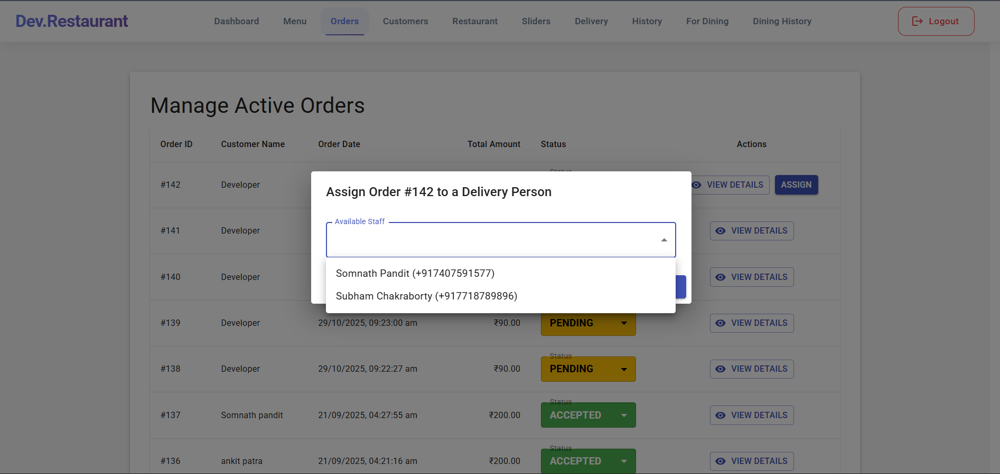
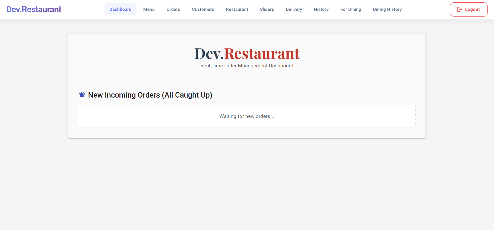
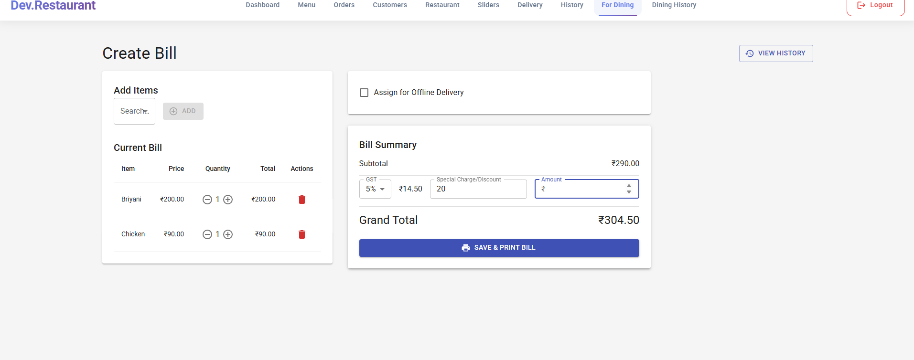
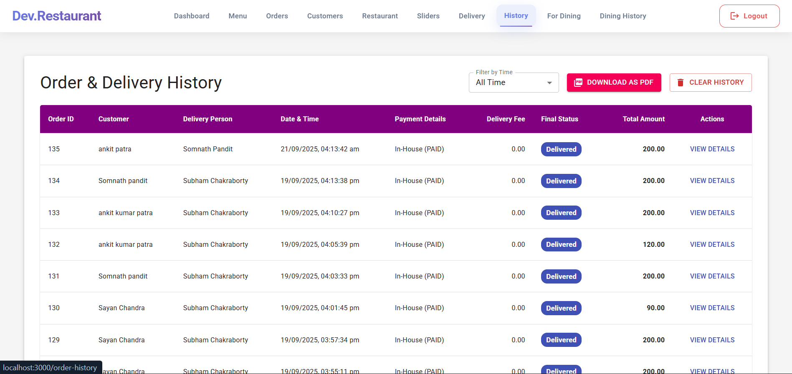
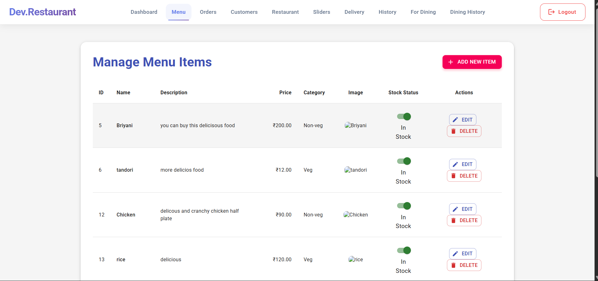
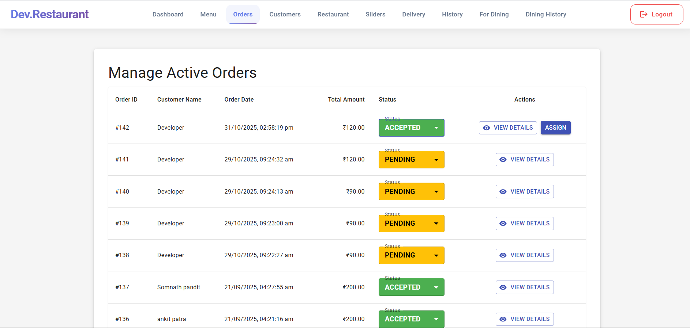
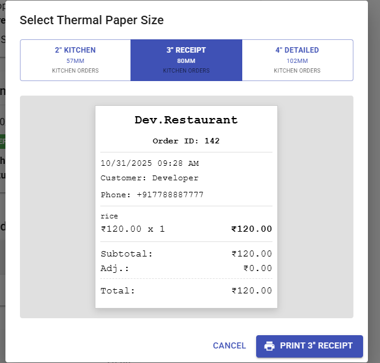

# dev.restaurant-webapp - Admin Web Dashboard 📊

The central control system for dev.restaurant-webapp ecosystem. Built with React and Material UI, this comprehensive web application acts as a unified portal for order management, dining POS (Point of Sale), advanced analytics, and dynamic content control.

##  Key Features

**Real-Time Order Management**
* Live polling system for new incoming orders with audio notifications.
* Order lifecycle tracking (`PENDING`, `PREPARING`, `READY`, `DELIVERED`).
* Direct assignment of orders to specific delivery personnel.

**Point of Sale (POS) & Dining Billing**
* Dedicated interface for creating dine-in or offline delivery bills.
* Dynamic GST calculation and custom special charge/discount adjustments.
* **Thermal Print Manager:** Native support for printing directly to 2-inch (57mm), 3-inch (80mm), and 4-inch (102mm) thermal kitchen and receipt printers.

**Advanced Analytics & Reporting**
* Interactive dashboards powered by Recharts (Revenue trends, Order status distribution).
* Top-selling menu item tracking and recent activity feeds.
* One-click PDF report generation for order history using `jsPDF`.

**Ecosystem Control**
* **Menu Management:** Full CRUD operations with image uploads and stock availability toggling.
* **Dynamic Sliders:** Upload and sequence promotional images for the customer-facing mobile app.
* **Staff & Customer Control:** Approve/remove delivery partners and block/unblock customer accounts.
* **Restaurant Details:** Toggle global "Open/Closed" store status and update operating hours.

##  Tech Stack
* **Frontend Framework:** React.js (React Router v6)
* **UI/UX:** Material UI (MUI) v5, Styled Components
* **Data Visualization:** Recharts
* **Document Generation:** jsPDF & jsPDF-AutoTable
* **Networking:** Axios (with JWT Interceptors)
* **State Management:** React Context API

## 📸 Screenshots

<div align="center">
  
  
  
  
  
  
  
  
</div>

##  Local Development Setup

**Clone the repository:**
   ```bash
   git clone [https://github.com/dev-restaurant-system/dev.restaurant-webapp.git](https://github.com/dev-restaurant-system/dev.restaurant-webapp.git) ```